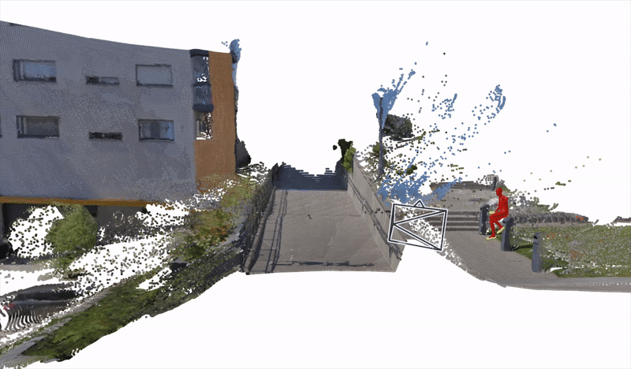
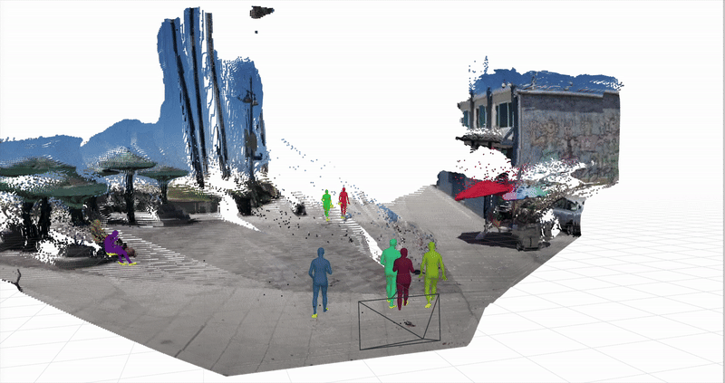

# Joint Optimization for 4D Human-Scene Reconstruction in the Wild

<a href="https://arxiv.org/abs/2501.02158"></a> 
<a href="https://vail-ucla.github.io/JOSH/"></a>

[Zhizheng Liu](https://scholar.google.com/citations?user=Asc7j9oAAAAJ&hl=en), [Joe Lin](https://github.com/joe-lin-tech), [Wayne Wu](https://wywu.github.io/), [Bolei Zhou](https://boleizhou.github.io/)
 <br>
     University of California, Los Angeles
 <br>
 

 ## Installation
### Setup the repo:
```
git clone --recursive git@github.com:genforce/JOSH.git
cd JOSH
conda create -n josh python=3.10 -y # must use python 3.10 for chumpy compatibility
conda activate josh
```
### Installing Dependencies (We use Ubuntu 22.04 + CUDA 12.8):
```
# assume CUDA 12.8, install pytorch and packages
pip install torch torchvision --index-url https://download.pytorch.org/whl/cu128
pip install -r requirements.txt 
pip install --no-build-isolation git+https://github.com/mattloper/chumpy
pip install -e .
```
### Download Pretrained Models
- Download SMPL body models (SMPL_MALE.pkl, SMPL_FEMALE.pkl, SMPL_NEUTRAL.pkl) at  [the official webpage](https://smpl.is.tue.mpg.de/index.html) and place then under `data/smpl` folder.
- Download [VIMO checkpoint](https://drive.google.com/file/d/1fdeUxn_hK4ERGFwuksFpV_-_PHZJuoiW/view?usp=share_link)(vimo_checkpoint.pth.tar) for HMR and place it under `data/checkpoints`.
- Download [DECO checkpoint](https://keeper.mpdl.mpg.de/f/6f2e2258558f46ceb269/?dl=1)(deco_best.pth) for contact estimation and place it under `data/checkpoints`.
## JOSH Demo
Assume the demo video is located at `$input_folder/XXXX.mp4`, run the following:
```
bash josh_demo.sh $input_folder
```
For example, run `bash josh_demo.sh assets/demo1`, we will store all the intermediate outputs as well as the final result under `$input_folder`.

Compared to the original paper, we now support using the local point cloud from the state-of-the-art method [Pi3X](https://github.com/yyfz/Pi3) as initialization, which could lead to a better reconstruction performance. 

Note that since JOSH is an optimization-based method, you may want to tune the hyper-parameters for the optimal performance (see [josh/config.py](josh/config.py)).
With the default hyperparameters, you should get the following results after running the demos:
### Demo 1 Sample Output

### Demo 2 Sample Output


## JOSH3R Demo
To be updated before the ICLR conference

## Evaluation
To be updated before the ICLR conference


## Acknowledgements
We would like to thank the following projects for inspiring our work and open-sourcing their implementations:

Human Mesh Recovery: [WHAM](https://github.com/yohanshin/WHAM), [TRAM](https://github.com/yufu-wang/tram), [HMR2.0](https://github.com/shubham-goel/4D-Humans)


Scene Reconstruction: [DUSt3R](https://github.com/naver/dust3r?tab=readme-ov-file), [MASt3R](https://github.com/naver/mast3r), [Pi3](https://github.com/yyfz/Pi3)

Human Contact Estimation: [BSTRO](https://github.com/paulchhuang/bstro), [DECO](https://github.com/sha2nkt/deco)

Evaluation Datasets: [EMDB](https://github.com/eth-ait/emdb), [SLOPER4D](https://github.com/climbingdaily/SLOPER4D), [RICH](https://github.com/paulchhuang/rich_toolkit)


 ## Contact

For any questions or discussions, please contact [Zhizheng Liu](zhizheng@cs.ucla.edu).

## Reference

If our work is helpful to your research, please cite the following:

```bibtex
@article{liu2026joint,
    title={Joint Optimization for 4D Human-Scene Reconstruction in the Wild},
    author={Liu, Zhizheng and Lin, Joe and Wu, Wayne and Zhou, Bolei},
    journal={The Fourteenth International Conference on Learning Representations},
    year={2026}
} 
```